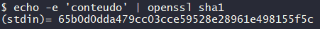
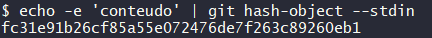
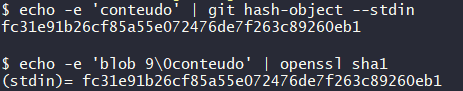

# Entendendo como o GIT funciona

Existem quatro tópicos fundamentais para entender como o GIT funciona, são eles:

- SHA1
- Objetos fundamentais
- Sistema distribuído
- Segurança

## SHA1

A sigla SHA significa Secure Hash Algoritmo, é um conjunto de funções hash criptográficas projetadas pela NSA (Agência de Segurança Nacional dos EUA). Basicamente, o algoritmo pega seu arquivo, seja ele qual for, e o embaralha em uma sequência de caracteres de forma muito específica e única contendo 40 dígitos. Isto é, se qualquer modificação for feita no arquivo, o `SHA1`  deste arquivo também será modificado e, consequentemente, está modificação será notada pelo sistema do GIT.

Para criar o `SHA1` de um arquivo basta digitar no terminal:

​	`openssl sha1 nome_arquivo.extensão`

Ou de uma sequencia de caracteres `echo -e 'conteudo' | openssl sha1` 

Por exemplo,

## Objetos fundamentais

Há três objetos fundamentais que precisamos compreender para trabalhar com o  versionamento do GIT, são eles:

* Blobs
* Trees
* Commits

Aprendemos que o `SHA1` é uma sequência de caracteres que representa o arquivo no qual estamos interessados.

Ao utilizar o GIT para criar o `SHA1` de uma sequência de caracteres, desta vez utilizando a função `git hash-object --stdin`, obtemos

O que mudou ? O GIT incorporou ao `SHA1` da palavra "conteudo" um outro objeto chamado `BLOB`. Um `BLOB` é um objeto específico do GIT que contém informações sobre o tipo do objeto (blob), o tamanho desse arquivo, uma barra invertida seguida por um zero e o conteúdo do arquivo.

Portanto, se utilizarmos o comando `echo -e 'conteudo' | openssl sha1` novamente, porém utilizando a sequência de caracteres 'blob 9 \0conteudo', obteremos o mesmo `SHA1` do comando `git hash-object --stdin` .

